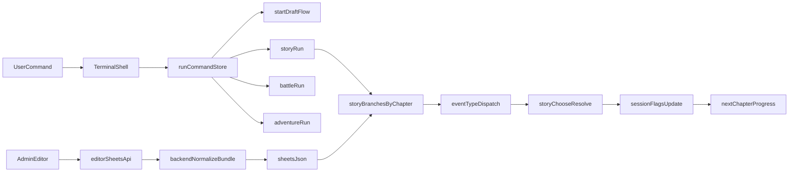

# Terminal DOS RPG

웹 기반 텍스트 RPG입니다. 브라우저에서 DOS 스타일 터미널 UI로 플레이하며, 관리자 시트 에디터로 콘텐츠를 편집할 수 있습니다.
현재 기본 작성자 설정은 `곽한승 <a4file@kakao.com>` 기준으로 사용합니다.

## 구성

- `frontend/`: React + Zustand + xterm 터미널 UI
- `backend/`: Express API (콘텐츠/AI/에디터)

## Git 원격 연결

로컬 저장소는 이미 초기화되어 있습니다. GitHub에 새 저장소를 만든 뒤:

```bash
cd /path/to/game
git remote add origin https://github.com/<사용자>/<저장소>.git
git branch -M main
git push -u origin main
```

GitHub CLI를 쓰는 경우 (`gh auth login` 후):

```bash
gh repo create <저장소이름> --private --source=. --remote=origin --push
```

## Vercel 배포

**프로젝트 Root Directory는 리포지토리 루트(`.` )** 로 두세요. `frontend/`만 지정하면 `api/` 서버리스와 루트 `vercel-build`가 빠져 백엔드가 동작하지 않습니다.

- **빌드**: `vercel.json` → `npm run vercel-build` → 백엔드 `tsc` + `docs/mythic-archive`·`sheets.json`을 `backend/dist/vercel-bundle/`에 복사 → 프론트 `vite build`
- **API(백엔드)**: 루트 `api/[[...slug]].js` + `serverless-http`로 Express를 서버리스에 올립니다. 클라이언트 기본 베이스 URL은 **`/api`** (`GET /api/health`, `GET /api/content/bundle` 등).
- **환경 변수**: `VITE_API_BASE_URL`을 비우면 위와 같이 **`/api`** 를 씁니다. 별 도메인/API만 쓸 때만 절대 URL을 넣으면 됩니다.

**Vercel 대시보드 → Environment Variables** (Production 등):

- `OPENROUTER_API_KEY`, `OPENROUTER_SITE_URL`, `OPENROUTER_MODEL`, `OPENROUTER_FALLBACK_MODELS` — AI 사용 시
- (선택) `CORS_ORIGIN` — API만 다른 도메인에 둘 때

**서버리스 제한**: `VERCEL=1`일 때 시트·바이블 저장은 **`/tmp`** 기반이라 **콜드 스타트마다 초기화**될 수 있습니다. 영구 저장이 필요하면 별도 DB·Blob·호스팅(Railway 등)으로 API를 분리하는 편이 좋습니다.

로컬에서 배포와 동일한 빌드를 시험하려면:

```bash
npm install
bash scripts/vercel-build.sh
```

## 실행

### backend

```bash
cd backend
npm install
npm run dev
```

기본 주소: `http://localhost:4000`

### frontend

```bash
cd frontend
npm install
npm run dev
```

기본 주소: `http://localhost:5173`

`.env` 예시:

```bash
VITE_API_BASE_URL=http://localhost:4000
```

## OpenRouter 설정

백엔드 환경변수:

```bash
OPENROUTER_API_KEY=sk-or-v1-your-key-here
OPENROUTER_SITE_URL=http://localhost:5173
OPENROUTER_MODEL=meta-llama/llama-3.1-8b-instruct:free
OPENROUTER_FALLBACK_MODELS=qwen/qwen-2.5-7b-instruct:free,mistralai/mistral-7b-instruct:free
```

`backend/.env` 파일을 사용하며, 기본 추천 무료 모델이 이미 설정되어 있습니다. 필요 시 `.env`에서 모델명을 바꾸면 즉시 반영됩니다.

키가 없거나 API 실패 시 룰 기반 폴백 문장을 반환합니다.

## 터미널 명령

- `help`
- `profile`
- `gacha 1 standard`
- `gacha 10 pickup`
- `battle`
- `adventure`
- `inventory`
- `equip`
- `levelup`
- `save`
- `load`
- `editor on`
- `editor off`

## 관리자 에디터

`editor on` 입력 시 우측 시트 에디터 활성화:

- 탭: `maps`, `characters`, `monsters`, `weapons`, `items`, `equipments`
- 인라인 셀 편집
- JSON export
- AI row 생성 / 셀 보조 suggestion

## 게임 구조 시각화



## 페이지 이벤트 타입

- `battle`: 전투 중심 장면, 전투형 선택 보상 강화
- `adventure`: 탐사/서사 장면, 단서 및 자원 획득
- `companion`: 동료 영입 시도 장면, 성공 시 계약 토큰
- `merchant`: 보부상 거래 장면, 할인 토큰/도박형 리스크
- `town`: 휴식/정비 장면, 안전 선택 보정 및 회복 자원

### 이벤트 밸런스 표 (story choose 기준)

| eventType | 기본 성공 선택 | 핵심 추가 보상 | 실패 추가 페널티(gem) |
|---|---|---|---|
| battle | A | `warCry +1` | +4 |
| adventure | B | `memoryShard +1` | +3 |
| companion | A | `allyContract +1` | +4 |
| merchant | B | `discountToken +1` | +6 |
| town | A | `restPass +1` | +2 |

- 공통 성공 보상: `eventTier` 기준 gem (`common=5`, `rare=10`, `legend=18`)
- 공통 실패 손실: `eventTier` 기준 gem (`common=3`, `rare=5`, `legend=7`) + 이벤트별 추가 페널티
- 동일 `eventType` 연속 성공(2회 이상): `memoryShard +1` 콤보 보너스

### 챕터 구간 스케일링

- `early (1~20)`: 보상 x1.00 / 페널티 x1.00 / 추가보상 x1.00
- `mid (21~45)`: 보상 x1.20 / 페널티 x1.25 / 추가보상 x1.10
- `late (46+)`: 보상 x1.40 / 페널티 x1.60 / 추가보상 x1.25

같은 이벤트 타입이라도 후반으로 갈수록 기대 보상과 실패 리스크가 함께 커져 긴장감을 유지합니다.

### eventTier 자동 상향 규칙

- `mid (21~45)`: `common` 챕터는 5챕터마다 `rare`로 승급
- `late (46+)`:
  - `common`은 짝수 챕터 `rare`, 6배수 챕터 `legend`
  - `rare`는 3배수 챕터 `legend`로 승급

즉, 후반으로 갈수록 `rare/legend` 체감 빈도가 의도적으로 증가합니다.

추가 튜닝(`eventType` 가중):
- `battle`: `rare -> legend` 승격이 가장 빠름(후반 짝수 챕터 고강도)
- `merchant`: `legend` 승격 빈도를 높여 고위험/고보상 거래 체감 강화
- `town`: 승격 주기를 완만하게 유지해 안정 구간 역할 유지

